# INTRODUCTION

This project involves analysis of stock prices of major tech companies such as Apple, Amazon, IBM, facebook, Google, Netflix, Tesla and Microsoft using the Sharpe Ratio, also known as the sharpe index. The sharpe ratio as defined by William Sharpe, is the measure of risk-adjusted return of a financial portfolio. Higher the Sharpe ratio, superior the portfolio when compared to its peers' portfolios in the market. 

Before we start with the execution of this project, it is important to understand the meaning of holding a share of a company. What exactly is it?
    A share is sort of a piece of the company that anybody who choses to invest their money, can buy or sell for a price that is set at any particular time depending on how the stock markets' performance is. The basic idea in stock market investment is to invest in a share of the company, whos' value shall increase over time. 
    
Are there risks to buying shares? Certainly. The risk lies in the fact that the stock market is highly volatile and value of the shares that an individual holds, at any point of time may drop. The result of which, is a huge loss of money after years of investment. But, when investing in shares of prominent companies, the benefits may outweigh the risks, as an investor can potentially earn a great deal of money as returns, while making more than the amount one initially invested even after paying tax for the profits and divends. 

So how would one know which of these prominent companies he/she can invest in, so as to minimise the risk, while potentially earning good returns? Statistics is the answer. The decision to invest, should be driven by the analysis of historical data by calculating the risks and returns for that available data of each of the prominent companies within a given timeframe. 

The data for this particular project was obtained from Yahoo Finance, the link for which is provided below:
    https://finance.yahoo.com/

As mentioned before, the crux of this project revolves around the sharpe ratio as mentioned above, which is given by:

                                            Average Excess Returns
## Daily Sharpe Ratio = ------------------------------------------
                                        Standard Deviation of Excess Returns
                       
                            
## Annual Sharpe Ratio = Daily Sharpe Ratio * Annual Factor.


```python
# Importing required modules
import os
import pandas as pd
import numpy as np
import matplotlib.pyplot as plt

#Setting Directory
os.chdir('F:/Internship/Stock Data/')
print(os.getcwd())

# Settings to produce nice plots in Jupyter notebook
plt.style.use('fivethirtyeight')
%matplotlib inline

# Reading in the data
Apple = pd.read_csv('AAPL.csv', parse_dates = True, index_col = 'Date')
Amazon = pd.read_csv('AMZN.csv', parse_dates = True, index_col = 'Date')
Facebook = pd.read_csv('FB.csv', parse_dates = True, index_col = 'Date')
Google = pd.read_csv('GOOG.csv', parse_dates = True, index_col = 'Date')
IBMstock = pd.read_csv('IBM.csv', parse_dates = True, index_col = 'Date')
Microsoft = pd.read_csv('MSFT.csv', parse_dates = True, index_col = 'Date')
Netflix = pd.read_csv('NFLX.csv', parse_dates = True, index_col = 'Date')
Tesla = pd.read_csv('TSLA.csv', parse_dates = True, index_col = 'Date')
SnP500 = pd.read_csv('S&P500.csv', parse_dates = True, index_col = 'Date')

# Taking a look at the loaded datasets
print(Apple.head())
print(Amazon.head())
print(Facebook.head())
print(Google.head())
print(IBMstock.head())
print(Microsoft.head())
print(Netflix.head())
print(Tesla.head())
print(SnP500.head())

Apple.info()
```

    F:\Internship\Stock Data
                      Open        High         Low       Close   Adj Close  \
    Date                                                                     
    2017-03-01  137.889999  140.149994  137.600006  139.789993  135.028976   
    2017-03-02  140.000000  140.279999  138.759995  138.960007  134.227295   
    2017-03-03  138.779999  139.830002  138.589996  139.779999  135.019348   
    2017-03-06  139.369995  139.770004  138.600006  139.339996  134.594330   
    2017-03-07  139.059998  139.979996  138.789993  139.520004  134.768204   
    
                  Volume  
    Date                  
    2017-03-01  36414600  
    2017-03-02  26211000  
    2017-03-03  21108100  
    2017-03-06  21750000  
    2017-03-07  17446300  
                      Open        High         Low       Close   Adj Close  \
    Date                                                                     
    2017-03-01  853.049988  854.830017  849.010010  853.080017  853.080017   
    2017-03-02  853.080017  854.820007  847.280029  848.909973  848.909973   
    2017-03-03  847.200012  851.989990  846.270020  849.880005  849.880005   
    2017-03-06  845.229980  848.489990  841.119995  846.609985  846.609985   
    2017-03-07  845.479980  848.460022  843.750000  846.020020  846.020020   
    
                 Volume  
    Date                 
    2017-03-01  2760100  
    2017-03-02  2132100  
    2017-03-03  1941100  
    2017-03-06  2610400  
    2017-03-07  2247600  
                      Open        High         Low       Close   Adj Close  \
    Date                                                                     
    2017-03-01  136.470001  137.479996  136.300003  137.419998  137.419998   
    2017-03-02  137.089996  137.820007  136.309998  136.759995  136.759995   
    2017-03-03  136.630005  137.330002  136.080002  137.169998  137.169998   
    2017-03-06  136.880005  137.830002  136.509995  137.419998  137.419998   
    2017-03-07  137.029999  138.369995  136.990005  137.300003  137.300003   
    
                  Volume  
    Date                  
    2017-03-01  16257000  
    2017-03-02  12294800  
    2017-03-03  11160600  
    2017-03-06  12748200  
    2017-03-07  13527100  
                      Open        High         Low       Close   Adj Close  \
    Date                                                                     
    2017-03-01  828.849976  836.255005  827.260010  835.239990  835.239990   
    2017-03-02  833.849976  834.510010  829.640015  830.630005  830.630005   
    2017-03-03  830.559998  831.359985  825.750977  829.080017  829.080017   
    2017-03-06  826.950012  828.880005  822.400024  827.780029  827.780029   
    2017-03-07  827.400024  833.409973  826.520020  831.909973  831.909973   
    
                 Volume  
    Date                 
    2017-03-01  1496500  
    2017-03-02   942500  
    2017-03-03   896400  
    2017-03-06  1109000  
    2017-03-07  1037600  
                      Open        High         Low       Close   Adj Close  \
    Date                                                                     
    2017-03-01  180.479996  182.550003  180.029999  181.949997  164.996353   
    2017-03-02  181.880005  181.880005  180.429993  180.529999  163.708633   
    2017-03-03  180.529999  181.320007  179.759995  180.050003  163.273376   
    2017-03-06  179.720001  180.990005  179.570007  180.470001  163.654251   
    2017-03-07  180.710007  181.289993  180.199997  180.380005  163.572601   
    
                 Volume  
    Date                 
    2017-03-01  3005600  
    2017-03-02  2918200  
    2017-03-03  1822000  
    2017-03-06  3204400  
    2017-03-07  2980500  
                     Open       High        Low      Close  Adj Close    Volume
    Date                                                                       
    2017-03-01  64.129997  64.989998  64.019997  64.940002  62.321438  26937500
    2017-03-02  64.690002  64.750000  63.880001  64.010002  61.428928  24539600
    2017-03-03  63.990002  64.279999  63.619999  64.250000  61.659248  18135900
    2017-03-06  63.970001  64.559998  63.810001  64.269997  61.678444  18750300
    2017-03-07  64.190002  64.779999  64.190002  64.400002  61.803211  18521000
                      Open        High         Low       Close   Adj Close  \
    Date                                                                     
    2017-03-01  142.839996  143.259995  142.100006  142.649994  142.649994   
    2017-03-02  142.149994  142.699997  139.089996  139.529999  139.529999   
    2017-03-03  139.690002  140.910004  138.259995  139.139999  139.139999   
    2017-03-06  141.000000  142.839996  140.539993  141.940002  141.940002   
    2017-03-07  141.990005  142.399994  140.380005  141.429993  141.429993   
    
                 Volume  
    Date                 
    2017-03-01  4170600  
    2017-03-02  6119900  
    2017-03-03  5399800  
    2017-03-06  7116100  
    2017-03-07  4241000  
                      Open        High         Low       Close   Adj Close  \
    Date                                                                     
    2017-03-01  254.179993  254.850006  249.110001  250.020004  250.020004   
    2017-03-02  249.710007  253.279999  248.270004  250.479996  250.479996   
    2017-03-03  250.740005  251.899994  249.000000  251.570007  251.570007   
    2017-03-06  247.910004  251.699997  247.509995  251.210007  251.210007   
    2017-03-07  251.919998  253.889999  248.320007  248.589996  248.589996   
    
                 Volume  
    Date                 
    2017-03-01  4809500  
    2017-03-02  3351800  
    2017-03-03  2919400  
    2017-03-06  3355500  
    2017-03-07  3459500  
                       Open         High          Low        Close    Adj Close  \
    Date                                                                          
    2017-03-01  2380.129883  2400.979980  2380.129883  2395.959961  2395.959961   
    2017-03-02  2394.750000  2394.750000  2380.169922  2381.919922  2381.919922   
    2017-03-03  2380.919922  2383.889893  2375.389893  2383.120117  2383.120117   
    2017-03-06  2375.229980  2378.800049  2367.979980  2375.310059  2375.310059   
    2017-03-07  2370.739990  2375.120117  2365.510010  2368.389893  2368.389893   
    
                    Volume  
    Date                    
    2017-03-01  4345180000  
    2017-03-02  3821320000  
    2017-03-03  3555260000  
    2017-03-06  3232700000  
    2017-03-07  3518390000  
    <class 'pandas.core.frame.DataFrame'>
    DatetimeIndex: 273 entries, 2017-03-01 to 2018-03-29
    Data columns (total 6 columns):
    Open         273 non-null float64
    High         273 non-null float64
    Low          273 non-null float64
    Close        273 non-null float64
    Adj Close    273 non-null float64
    Volume       273 non-null int64
    dtypes: float64(5), int64(1)
    memory usage: 14.9 KB
    

## VISUAL EXPLORATORY DATA ANALYSIS

This is done to get a good understanding of how the value has traversed over the year [i.e., from 1st of March, 2017 to the 29th of March, 2018]. The following plots show the change in value over time with respect to each of the comapnies we are interested to invest in. 


```python
Apple['Low'].plot()
Apple['High'].plot()
Apple['Adj Close'].plot()
plt.legend()
plt.title('AAPL Shares')
```


    Text(0.5,1,'AAPL Shares')


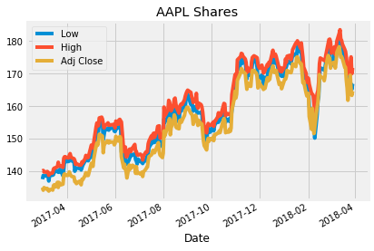


```python
Amazon.Low.plot()
Amazon.High.plot()
Amazon['Adj Close'].plot()
plt.legend()
plt.title('AMZN Shares')
```


    Text(0.5,1,'AMZN Shares')


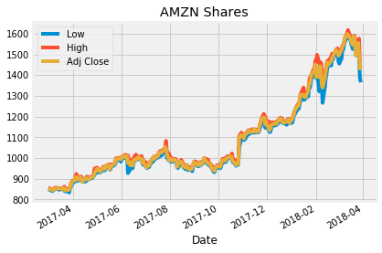


```python
Tesla.Low.plot()
Tesla.High.plot()
Tesla['Adj Close'].plot()
plt.legend()
plt.title('TSLA Shares')
```


    Text(0.5,1,'TSLA Shares')


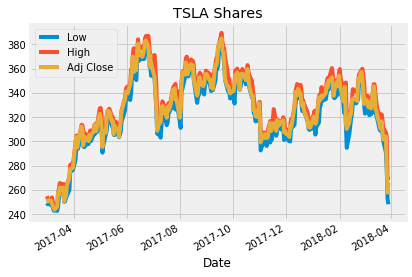


```python
Microsoft.Low.plot()
Microsoft.High.plot()
Microsoft['Adj Close'].plot()
plt.legend()
plt.title('MSFT Shares')
```


    Text(0.5,1,'MSFT Shares')


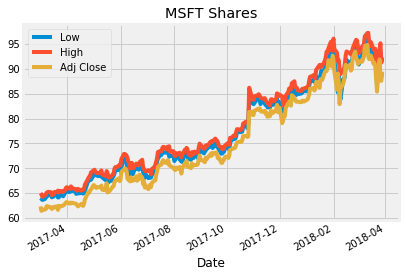


```python
Netflix.Low.plot()
Netflix.High.plot()
Netflix['Adj Close'].plot()
plt.legend()
plt.title('NFLX Shares')
```


    Text(0.5,1,'NFLX Shares')


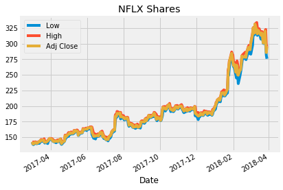


```python
Facebook.Low.plot()
Facebook.High.plot()
Facebook['Adj Close'].plot()
plt.legend()
plt.title('FB Shares')
```


    Text(0.5,1,'FB Shares')


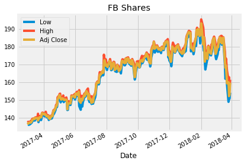


```python
Google.Low.plot()
Google.High.plot()
Google['Adj Close'].plot()
plt.legend()
plt.title('GOOG Shares')
```


    Text(0.5,1,'GOOG Shares')


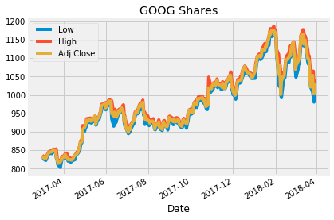


```python
IBMstock.Low.plot()
IBMstock.High.plot()
IBMstock['Adj Close'].plot()
plt.legend()
plt.title('IBM Shares')
```


    Text(0.5,1,'IBM Shares')


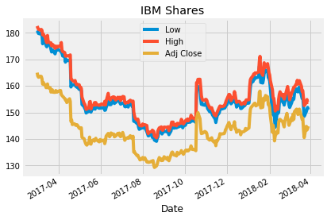


```python
SnP500.Low.plot()
SnP500.High.plot()
SnP500['Adj Close'].plot()
plt.legend()
plt.title('S&P 500 Shares')
```


    Text(0.5,1,'S&P 500 Shares')


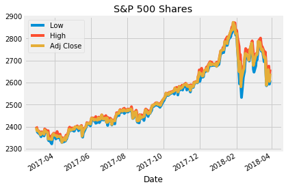


## EXTRACTING THE CLOSING VALUES 

The closing value is the final value of the companys' shares for that particular day just before the stock market closes or retires. Here, we select the closing values and store them in a dataframe named after the market representation of each of these companies, so that we can put them all together into a single dataframe later on.  


```python
AAPL = pd.DataFrame(Apple['Adj Close'])
AAPL.columns = ['Apple']

AMZN = pd.DataFrame(Amazon['Adj Close'])
AMZN.columns = ['Amazon']

FB = pd.DataFrame(Facebook['Adj Close'])
FB.columns = ['facebook']

GOOG = pd.DataFrame(Google['Adj Close'])
GOOG.columns = ['Google']

IBM = pd.DataFrame(IBMstock['Adj Close'])
IBM.columns = ['IBM']

MSFT = pd.DataFrame(Microsoft['Adj Close'])
MSFT.columns = ['Microsoft']

NFLX = pd.DataFrame(Netflix['Adj Close'])
NFLX.columns = ['Netflix']

TSLA = pd.DataFrame(Tesla['Adj Close'])
TSLA.columns = ['Tesla']
```

## COMBINING STOCK DATA

The previously created pandas dataframes are now passed as a list to the pandas concat function in order to combine these into a single dataframe that we can operate on with ease rather than working on one dataframe at a time.


```python
#list of dataframes 
frames = [AAPL, AMZN, FB, GOOG, IBM, MSFT, NFLX, TSLA]

#combining data across columns
Stock_Data = pd.concat(frames, axis = 1)

#Cleaning data by removing null values
Stock_Data.dropna()

#Checking for any leftover null values
Stock_Data.isna().sum()
```


    Apple        0
    Amazon       0
    facebook     0
    Google       0
    IBM          0
    Microsoft    0
    Netflix      0
    Tesla        0
    dtype: int64


## BENCHMARK

As done previously for the stock data of companies individually, we repeat the process here for the S&P 500 data. The S&P 500, or just the S&P, is an American stock market index based on the market capitalizations of 500 large companies having common stock listed on the NYSE, NASDAQ, or the Cboe BZX Exchange.


```python
SP500 = pd.DataFrame(SnP500['Adj Close'])
SP500.columns = ['S&P 500']

SP500.dropna()
SP500.isna().sum()
```


    S&P 500    0
    dtype: int64


```python
print('Stock Value \n')

#Exploring stock data
print(Stock_Data.info())
print(Stock_Data.head(n = 50))

print('\n')

print('Benchmark \n')

#Exploring benchamrk data
print(SP500.info())
print(SP500.head(n = 50))
```

    Stock Value 
    
    <class 'pandas.core.frame.DataFrame'>
    DatetimeIndex: 273 entries, 2017-03-01 to 2018-03-29
    Data columns (total 8 columns):
    Apple        273 non-null float64
    Amazon       273 non-null float64
    facebook     273 non-null float64
    Google       273 non-null float64
    IBM          273 non-null float64
    Microsoft    273 non-null float64
    Netflix      273 non-null float64
    Tesla        273 non-null float64
    dtypes: float64(8)
    memory usage: 19.2 KB
    None
                     Apple      Amazon    facebook      Google         IBM  \
    Date                                                                     
    2017-03-01  135.028976  853.080017  137.419998  835.239990  164.996353   
    2017-03-02  134.227295  848.909973  136.759995  830.630005  163.708633   
    2017-03-03  135.019348  849.880005  137.169998  829.080017  163.273376   
    2017-03-06  134.594330  846.609985  137.419998  827.780029  163.654251   
    2017-03-07  134.768204  846.020020  137.300003  831.909973  163.572601   
    2017-03-08  134.265915  850.500000  137.720001  835.369995  162.729263   
    2017-03-09  133.956802  853.000000  138.240005  838.679993  160.670776   
    2017-03-10  134.401154  852.460022  138.789993  843.250000  161.260223   
    2017-03-13  134.459091  854.590027  139.600006  845.539978  160.017868   
    2017-03-14  134.256256  852.530029  139.320007  845.619995  159.346817   
    2017-03-15  135.676193  852.969971  139.720001  847.200012  159.428436   
    2017-03-16  135.898361  853.419983  139.990005  848.780029  160.725174   
    2017-03-17  135.222229  852.309998  139.839996  852.119995  159.283340   
    2017-03-20  136.642136  856.969971  139.940002  848.400024  159.328690   
    2017-03-21  135.077301  843.200012  138.509995  830.460022  157.678299   
    2017-03-22  136.603500  848.059998  139.589996  829.590027  158.494415   
    2017-03-23  136.120514  847.380005  139.529999  817.580017  158.530716   
    2017-03-24  135.850052  845.609985  140.339996  814.429993  157.632935   
    2017-03-27  136.081879  846.820007  140.320007  819.510010  157.578522   
    2017-03-28  138.902451  856.000000  141.759995  820.919983  158.249557   
    2017-03-29  139.211563  874.320007  142.649994  831.409973  157.732712   
    2017-03-30  139.028015  876.340027  142.410004  831.500000  157.660141   
    2017-03-31  138.767197  886.539978  142.050003  829.559998  157.914032   
    2017-04-03  138.805832  891.510010  142.279999  838.549988  158.240509   
    2017-04-04  139.839371  906.830017  141.729996  834.570007  158.258636   
    2017-04-05  139.114960  909.280029  141.850006  831.409973  156.771454   
    2017-04-06  138.767197  898.280029  141.169998  827.880005  156.381500   
    2017-04-07  138.458099  894.880005  140.779999  824.669983  156.100403   
    2017-04-10  138.293900  907.039978  141.039993  824.729980  155.247986   
    2017-04-11  136.806366  902.359985  139.919998  823.349976  154.685776   
    2017-04-12  136.970566  896.229980  139.580002  824.320007  154.758286   
    2017-04-13  136.246109  884.669983  139.389999  823.559998  153.733597   
    2017-04-17  136.999512  901.989990  141.419998  837.169983  155.157303   
    2017-04-18  136.391006  903.780029  140.960007  836.820007  154.205154   
    2017-04-19  135.888687  899.200012  142.270004  838.210022  146.624115   
    2017-04-20  137.588776  902.059998  143.800003  841.650024  147.177277   
    2017-04-21  137.424545  898.530029  143.679993  843.190002  145.436172   
    2017-04-24  138.747894  907.409973  145.470001  862.760010  145.771698   
    2017-04-25  139.607590  907.619995  146.490005  872.299988  145.445267   
    2017-04-26  138.786530  909.289978  146.559998  871.729980  145.145981   
    2017-04-27  138.892776  918.380005  147.699997  874.250000  145.381760   
    2017-04-28  138.757538  924.989990  150.250000  905.960022  145.354553   
    2017-05-01  141.587769  948.229980  152.460007  912.570007  144.039658   
    2017-05-02  142.486099  946.940002  152.779999  916.440002  144.275452   
    2017-05-03  142.051422  941.030029  151.800003  927.039978  143.849228   
    2017-05-04  141.539459  937.530029  150.850006  931.659973  144.230118   
    2017-05-05  143.886719  934.150024  150.240005  927.130005  140.602814   
    2017-05-08  147.798767  949.039978  151.059998  934.299988  140.126648   
    2017-05-09  148.745392  952.820007  150.479996  932.169983  139.284210   
    2017-05-10  148.040237  948.950012  150.289993  928.780029  138.496750   
    
                Microsoft     Netflix       Tesla  
    Date                                           
    2017-03-01  62.321438  142.649994  250.020004  
    2017-03-02  61.428928  139.529999  250.479996  
    2017-03-03  61.659248  139.139999  251.570007  
    2017-03-06  61.678444  141.940002  251.210007  
    2017-03-07  61.803211  141.429993  248.589996  
    2017-03-08  62.369411  140.320007  246.869995  
    2017-03-09  62.119892  140.529999  244.899994  
    2017-03-10  62.311829  140.889999  243.690002  
    2017-03-13  62.100704  143.520004  246.169998  
    2017-03-14  61.812801  143.190002  258.000000  
    2017-03-15  62.139091  145.250000  255.729996  
    2017-03-16  62.033531  144.389999  262.049988  
    2017-03-17  62.254253  145.110001  261.500000  
    2017-03-20  62.311829  145.830002  261.920013  
    2017-03-21  61.620869  142.419998  250.679993  
    2017-03-22  62.407799  142.649994  255.009995  
    2017-03-23  62.254253  141.839996  254.779999  
    2017-03-24  62.359821  142.020004  263.160004  
    2017-03-27  62.474976  144.059998  270.220001  
    2017-03-28  62.657314  145.169998  277.450012  
    2017-03-29  62.830051  146.470001  277.380005  
    2017-03-30  63.060390  148.059998  277.920013  
    2017-03-31  63.204323  147.809998  278.299988  
    2017-04-03  62.906837  146.919998  298.519989  
    2017-04-04  63.079582  145.500000  303.700012  
    2017-04-05  62.916428  143.619995  295.000000  
    2017-04-06  63.079582  143.740005  298.700012  
    2017-04-07  63.031605  143.110001  302.540009  
    2017-04-10  62.887638  143.850006  312.390015  
    2017-04-11  62.839657  144.350006  308.709991  
    2017-04-12  62.599735  143.830002  296.839996  
    2017-04-13  62.331020  142.919998  304.000000  
    2017-04-17  62.839657  147.250000  301.440002  
    2017-04-18  62.753292  143.360001  300.250000  
    2017-04-19  62.417404  139.759995  305.519989  
    2017-04-20  62.858852  141.179993  302.510010  
    2017-04-21  63.722557  142.869995  305.600006  
    2017-04-24  64.806992  143.830002  308.029999  
    2017-04-25  65.181267  152.160004  313.790009  
    2017-04-26  65.094894  150.169998  310.170013  
    2017-04-27  65.517151  153.080002  308.630005  
    2017-04-28  65.699493  152.199997  314.070007  
    2017-05-01  66.611198  155.350006  322.829987  
    2017-05-02  66.505623  156.449997  318.890015  
    2017-05-03  66.294502  155.589996  311.019989  
    2017-05-04  66.035378  157.250000  295.459991  
    2017-05-05  66.217712  156.600006  308.350006  
    2017-05-08  66.160141  156.380005  307.190002  
    2017-05-09  66.256119  157.460007  321.260010  
    2017-05-10  66.515221  160.279999  325.220001  
    
    
    Benchmark 
    
    <class 'pandas.core.frame.DataFrame'>
    DatetimeIndex: 273 entries, 2017-03-01 to 2018-03-29
    Data columns (total 1 columns):
    S&P 500    273 non-null float64
    dtypes: float64(1)
    memory usage: 4.3 KB
    None
                    S&P 500
    Date                   
    2017-03-01  2395.959961
    2017-03-02  2381.919922
    2017-03-03  2383.120117
    2017-03-06  2375.310059
    2017-03-07  2368.389893
    2017-03-08  2362.979980
    2017-03-09  2364.870117
    2017-03-10  2372.600098
    2017-03-13  2373.469971
    2017-03-14  2365.449951
    2017-03-15  2385.260010
    2017-03-16  2381.379883
    2017-03-17  2378.250000
    2017-03-20  2373.469971
    2017-03-21  2344.020020
    2017-03-22  2348.449951
    2017-03-23  2345.959961
    2017-03-24  2343.979980
    2017-03-27  2341.590088
    2017-03-28  2358.570068
    2017-03-29  2361.129883
    2017-03-30  2368.060059
    2017-03-31  2362.719971
    2017-04-03  2358.840088
    2017-04-04  2360.159912
    2017-04-05  2352.949951
    2017-04-06  2357.489990
    2017-04-07  2355.540039
    2017-04-10  2357.159912
    2017-04-11  2353.780029
    2017-04-12  2344.929932
    2017-04-13  2328.949951
    2017-04-17  2349.010010
    2017-04-18  2342.189941
    2017-04-19  2338.169922
    2017-04-20  2355.840088
    2017-04-21  2348.689941
    2017-04-24  2374.149902
    2017-04-25  2388.610107
    2017-04-26  2387.449951
    2017-04-27  2388.770020
    2017-04-28  2384.199951
    2017-05-01  2388.330078
    2017-05-02  2391.169922
    2017-05-03  2388.129883
    2017-05-04  2389.520020
    2017-05-05  2399.290039
    2017-05-08  2399.379883
    2017-05-09  2396.919922
    2017-05-10  2399.629883
    


```python
Stock_Data.plot(subplots = True, figsize=(15,15))

plt.title('Stock Market Closing Value')

#Checking statistical distribution of data
Stock_Data.describe()

```


<div>
<style scoped>
    .dataframe tbody tr th:only-of-type {
        vertical-align: middle;
    }

    .dataframe tbody tr th {
        vertical-align: top;
    }

    .dataframe thead th {
        text-align: right;
    }
</style>
<table border="1" class="dataframe">
  <thead>
    <tr style="text-align: right;">
      <th></th>
      <th>Apple</th>
      <th>Amazon</th>
      <th>facebook</th>
      <th>Google</th>
      <th>IBM</th>
      <th>Microsoft</th>
      <th>Netflix</th>
      <th>Tesla</th>
    </tr>
  </thead>
  <tbody>
    <tr>
      <th>count</th>
      <td>273.000000</td>
      <td>273.000000</td>
      <td>273.000000</td>
      <td>273.000000</td>
      <td>273.000000</td>
      <td>273.000000</td>
      <td>273.000000</td>
      <td>273.000000</td>
    </tr>
    <tr>
      <th>mean</th>
      <td>154.616159</td>
      <td>1092.390145</td>
      <td>165.472930</td>
      <td>978.135128</td>
      <td>143.566688</td>
      <td>75.198022</td>
      <td>193.074212</td>
      <td>326.821026</td>
    </tr>
    <tr>
      <th>std</th>
      <td>12.632273</td>
      <td>206.245318</td>
      <td>15.205829</td>
      <td>91.983584</td>
      <td>8.283395</td>
      <td>9.725687</td>
      <td>49.249499</td>
      <td>30.269022</td>
    </tr>
    <tr>
      <th>min</th>
      <td>133.956802</td>
      <td>843.200012</td>
      <td>136.759995</td>
      <td>814.429993</td>
      <td>129.272202</td>
      <td>61.428928</td>
      <td>139.139999</td>
      <td>243.690002</td>
    </tr>
    <tr>
      <th>25%</th>
      <td>143.326370</td>
      <td>958.489990</td>
      <td>151.059998</td>
      <td>924.690002</td>
      <td>138.203720</td>
      <td>67.350113</td>
      <td>157.020004</td>
      <td>310.549988</td>
    </tr>
    <tr>
      <th>50%</th>
      <td>153.081329</td>
      <td>995.890015</td>
      <td>170.009995</td>
      <td>964.859985</td>
      <td>142.223587</td>
      <td>72.007454</td>
      <td>183.600006</td>
      <td>328.980011</td>
    </tr>
    <tr>
      <th>75%</th>
      <td>167.185913</td>
      <td>1179.140015</td>
      <td>178.300003</td>
      <td>1041.099976</td>
      <td>147.885086</td>
      <td>83.388779</td>
      <td>199.179993</td>
      <td>348.049988</td>
    </tr>
    <tr>
      <th>max</th>
      <td>178.307755</td>
      <td>1598.390015</td>
      <td>193.089996</td>
      <td>1175.839966</td>
      <td>164.996353</td>
      <td>94.812752</td>
      <td>331.440002</td>
      <td>385.000000</td>
    </tr>
  </tbody>
</table>
</div>


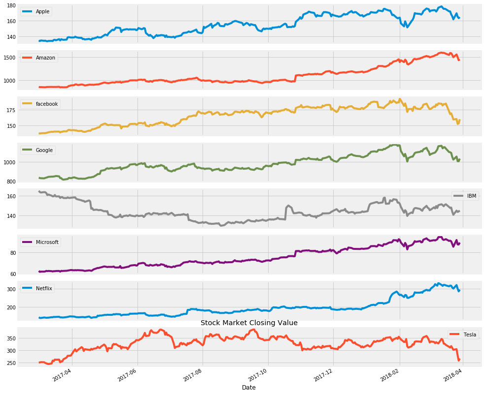


```python
SP500.plot()
plt.title('Fortune 500 Benchmark Stock Value')

#Checking for statistical distribution of data
SP500.describe()
```


<div>
<style scoped>
    .dataframe tbody tr th:only-of-type {
        vertical-align: middle;
    }

    .dataframe tbody tr th {
        vertical-align: top;
    }

    .dataframe thead th {
        text-align: right;
    }
</style>
<table border="1" class="dataframe">
  <thead>
    <tr style="text-align: right;">
      <th></th>
      <th>S&amp;P 500</th>
    </tr>
  </thead>
  <tbody>
    <tr>
      <th>count</th>
      <td>273.000000</td>
    </tr>
    <tr>
      <th>mean</th>
      <td>2533.661653</td>
    </tr>
    <tr>
      <th>std</th>
      <td>140.306802</td>
    </tr>
    <tr>
      <th>min</th>
      <td>2328.949951</td>
    </tr>
    <tr>
      <th>25%</th>
      <td>2425.179932</td>
    </tr>
    <tr>
      <th>50%</th>
      <td>2496.479980</td>
    </tr>
    <tr>
      <th>75%</th>
      <td>2648.939941</td>
    </tr>
    <tr>
      <th>max</th>
      <td>2872.870117</td>
    </tr>
  </tbody>
</table>
</div>


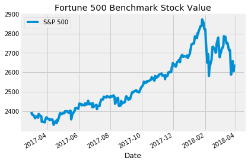


## Calculating the RETURN on Stock

This is done by using the pct_change function associated with the pandas dataframe. pct_change() function calculates the percentage change between the current and the previous element. 


```python
Stock_Returns = Stock_Data.pct_change()

#Checking for variations in returns
Stock_Returns.plot()

Stock_Returns.plot(subplots = True, figsize=(15,15))

#Statistical signinficance
Stock_Returns.describe()
```


<div>
<style scoped>
    .dataframe tbody tr th:only-of-type {
        vertical-align: middle;
    }

    .dataframe tbody tr th {
        vertical-align: top;
    }

    .dataframe thead th {
        text-align: right;
    }
</style>
<table border="1" class="dataframe">
  <thead>
    <tr style="text-align: right;">
      <th></th>
      <th>Apple</th>
      <th>Amazon</th>
      <th>facebook</th>
      <th>Google</th>
      <th>IBM</th>
      <th>Microsoft</th>
      <th>Netflix</th>
      <th>Tesla</th>
    </tr>
  </thead>
  <tbody>
    <tr>
      <th>count</th>
      <td>272.000000</td>
      <td>272.000000</td>
      <td>272.000000</td>
      <td>272.000000</td>
      <td>272.000000</td>
      <td>272.000000</td>
      <td>272.000000</td>
      <td>272.000000</td>
    </tr>
    <tr>
      <th>mean</th>
      <td>0.000808</td>
      <td>0.002057</td>
      <td>0.000657</td>
      <td>0.000861</td>
      <td>-0.000414</td>
      <td>0.001409</td>
      <td>0.002910</td>
      <td>0.000514</td>
    </tr>
    <tr>
      <th>std</th>
      <td>0.012634</td>
      <td>0.015133</td>
      <td>0.014251</td>
      <td>0.012904</td>
      <td>0.011504</td>
      <td>0.012787</td>
      <td>0.021698</td>
      <td>0.023844</td>
    </tr>
    <tr>
      <th>min</th>
      <td>-0.043390</td>
      <td>-0.046782</td>
      <td>-0.067697</td>
      <td>-0.050454</td>
      <td>-0.049162</td>
      <td>-0.051334</td>
      <td>-0.061370</td>
      <td>-0.086290</td>
    </tr>
    <tr>
      <th>25%</th>
      <td>-0.004989</td>
      <td>-0.004920</td>
      <td>-0.004493</td>
      <td>-0.004212</td>
      <td>-0.005398</td>
      <td>-0.003932</td>
      <td>-0.007006</td>
      <td>-0.012684</td>
    </tr>
    <tr>
      <th>50%</th>
      <td>0.000201</td>
      <td>0.001704</td>
      <td>0.001088</td>
      <td>0.001691</td>
      <td>0.000118</td>
      <td>0.001277</td>
      <td>0.001082</td>
      <td>0.000604</td>
    </tr>
    <tr>
      <th>75%</th>
      <td>0.007166</td>
      <td>0.009873</td>
      <td>0.008242</td>
      <td>0.007987</td>
      <td>0.004421</td>
      <td>0.007079</td>
      <td>0.012871</td>
      <td>0.015527</td>
    </tr>
    <tr>
      <th>max</th>
      <td>0.047472</td>
      <td>0.132164</td>
      <td>0.044174</td>
      <td>0.048028</td>
      <td>0.088645</td>
      <td>0.075705</td>
      <td>0.135436</td>
      <td>0.072655</td>
    </tr>
  </tbody>
</table>
</div>


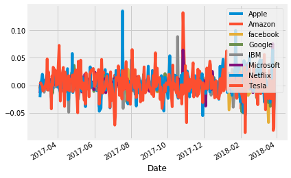


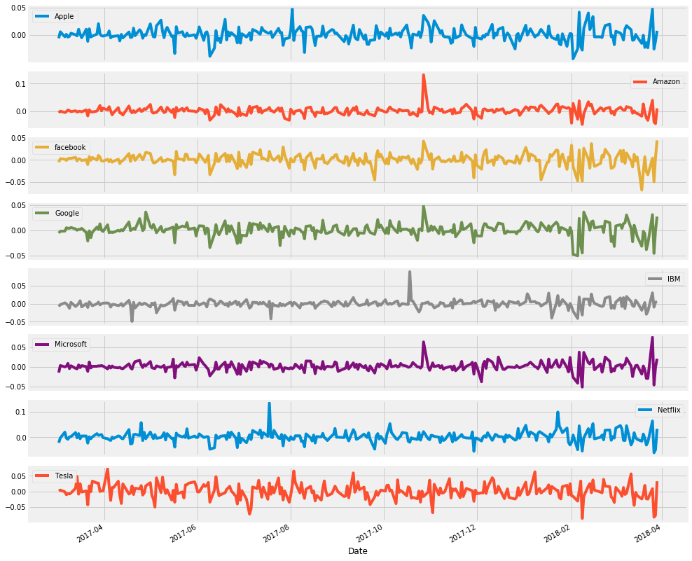


## Calculating RETURN on Benchmark data


```python
Benchmark_Returns = SP500['S&P 500'].pct_change()

Benchmark_Returns.plot(color = 'magenta')

Benchmark_Returns.describe()
```


    count    272.000000
    mean       0.000382
    std        0.006968
    min       -0.040979
    25%       -0.001631
    50%        0.000556
    75%        0.002933
    max        0.027157
    Name: S&P 500, dtype: float64


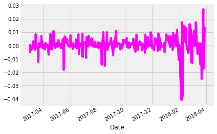


## Calculating Excess RETURN

Excess Return is given by the difference between the return on stock and return on benchmark.


```python
Excess_Returns = Stock_Returns.sub(Benchmark_Returns, axis = 0)

Excess_Returns.plot(subplots = True, figsize=(15,15))

Excess_Returns.describe()
```


<div>
<style scoped>
    .dataframe tbody tr th:only-of-type {
        vertical-align: middle;
    }

    .dataframe tbody tr th {
        vertical-align: top;
    }

    .dataframe thead th {
        text-align: right;
    }
</style>
<table border="1" class="dataframe">
  <thead>
    <tr style="text-align: right;">
      <th></th>
      <th>Apple</th>
      <th>Amazon</th>
      <th>facebook</th>
      <th>Google</th>
      <th>IBM</th>
      <th>Microsoft</th>
      <th>Netflix</th>
      <th>Tesla</th>
    </tr>
  </thead>
  <tbody>
    <tr>
      <th>count</th>
      <td>272.000000</td>
      <td>272.000000</td>
      <td>272.000000</td>
      <td>272.000000</td>
      <td>272.000000</td>
      <td>272.000000</td>
      <td>272.000000</td>
      <td>272.000000</td>
    </tr>
    <tr>
      <th>mean</th>
      <td>0.000426</td>
      <td>0.001675</td>
      <td>0.000274</td>
      <td>0.000478</td>
      <td>-0.000796</td>
      <td>0.001027</td>
      <td>0.002528</td>
      <td>0.000132</td>
    </tr>
    <tr>
      <th>std</th>
      <td>0.009561</td>
      <td>0.012957</td>
      <td>0.011324</td>
      <td>0.008930</td>
      <td>0.009923</td>
      <td>0.008558</td>
      <td>0.018873</td>
      <td>0.022257</td>
    </tr>
    <tr>
      <th>min</th>
      <td>-0.037947</td>
      <td>-0.041319</td>
      <td>-0.053493</td>
      <td>-0.033316</td>
      <td>-0.047446</td>
      <td>-0.036688</td>
      <td>-0.055008</td>
      <td>-0.073854</td>
    </tr>
    <tr>
      <th>25%</th>
      <td>-0.004424</td>
      <td>-0.004677</td>
      <td>-0.004150</td>
      <td>-0.003822</td>
      <td>-0.004851</td>
      <td>-0.003194</td>
      <td>-0.006667</td>
      <td>-0.014182</td>
    </tr>
    <tr>
      <th>50%</th>
      <td>0.000085</td>
      <td>0.000922</td>
      <td>0.000781</td>
      <td>0.000596</td>
      <td>-0.000670</td>
      <td>0.000425</td>
      <td>0.000489</td>
      <td>-0.000473</td>
    </tr>
    <tr>
      <th>75%</th>
      <td>0.005013</td>
      <td>0.007596</td>
      <td>0.005858</td>
      <td>0.005555</td>
      <td>0.003371</td>
      <td>0.004798</td>
      <td>0.011330</td>
      <td>0.013045</td>
    </tr>
    <tr>
      <th>max</th>
      <td>0.046758</td>
      <td>0.124091</td>
      <td>0.034417</td>
      <td>0.039955</td>
      <td>0.087902</td>
      <td>0.056046</td>
      <td>0.134838</td>
      <td>0.074298</td>
    </tr>
  </tbody>
</table>
</div>


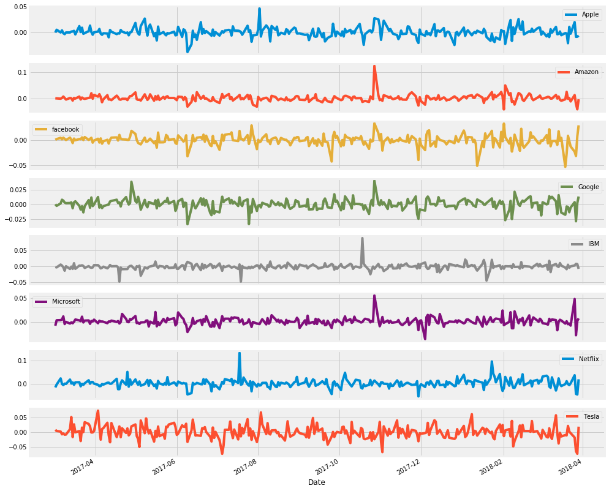


## Calculating the mean Excess Return value


```python
Avger = Excess_Returns.mean()

Avger.plot.bar()
plt.title(' Return DIfference Average ')
```


    Text(0.5,1,' Return DIfference Average ')


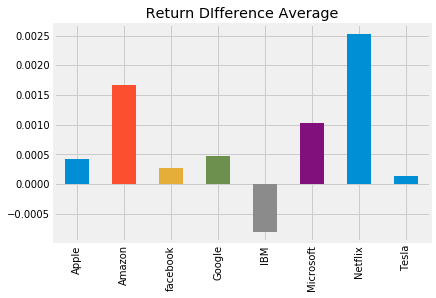


## Calculating Deviance 


```python
StdDever = Excess_Returns.std()

StdDever.plot.bar()

plt.title('Std Return Difference')
```


    Text(0.5,1,'Std Return Difference')


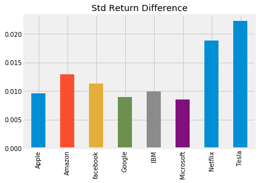


## DAILY & ANNUAL SHARPE RATIO 


```python
DSR = Avger.div(StdDever)

#the annual factor calculated as the length of the benchmark data
y_factor = np.sqrt(len(SP500))

ASR = DSR.mul(y_factor)

ASR.plot.bar()

plt.title('Annual Sharpe Ratio : Stocks v/s S&P 500')
```


    Text(0.5,1,'Annual Sharpe Ratio : Stocks v/s S&P 500')


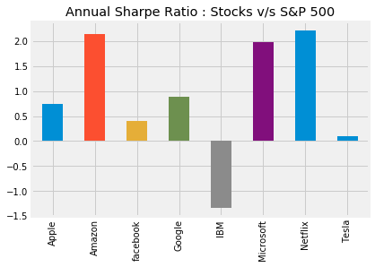


Generally, a sharpe ratio of 3.0 or higher is considered to be excellent. But, surely that value for a sharpe ratio cannot be obtained at all times. And as we can observe from the above plot, Amazon, Netfix and Microsoft shares have a good score of around 2.0 while the rest only, barely, make it upto less than 1.0. As already mentioned before, the higher the sharpe ratio, better the investment. Hence, it is wise to have invested in Netflix, Amazon and Microsoft, in that order, for good returns over the year [03/01/2017 to 03/29/2018].
